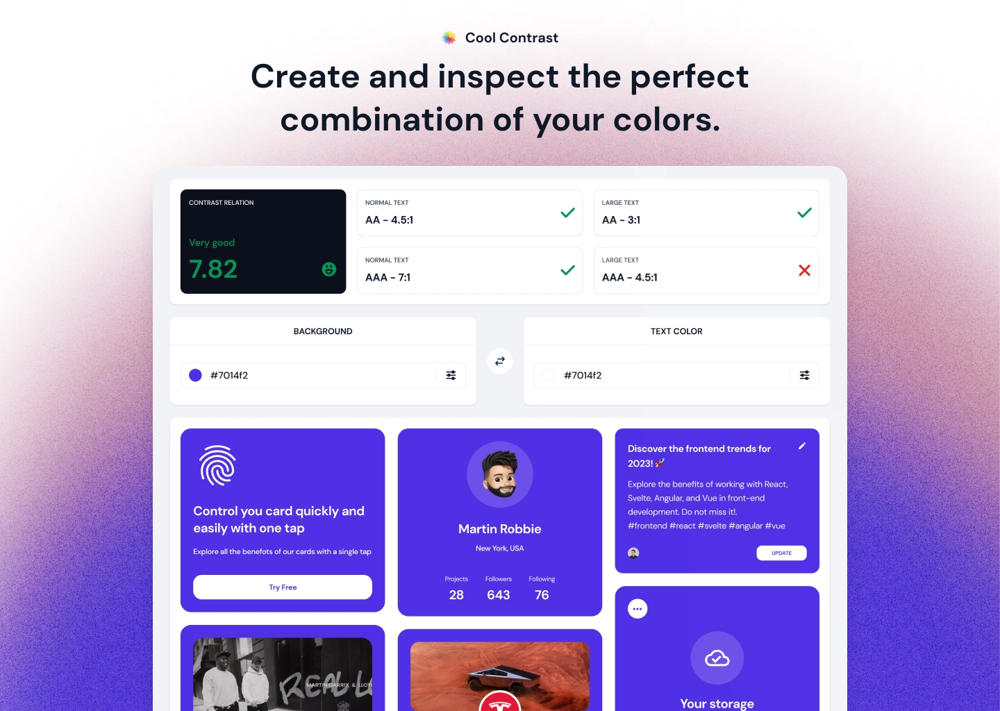

## Features

- 🔎 Feedback on contrast ratio and compliance levels.
- ⚡️ Suggestions to enhance your colors contrast.
- 👀 Preview the results with samples, such as a minimalistic page or a set of UI elements.
- 🎨 Editing in different color spaces.

## Install

Install packages

```bash
npm install
```

Run to generate panda-css output

```bash
npm run panda:prepare
```

Start the dev server

```bash
npm run dev
```

## Building

```bash
npm run panda:prepare && npm run build
```

## Testing

```bash
# execute test suites
npm run test

# generates code coverage reports 
npm run test:coverage
```

## License

MIT License © 2023-2024-Present [Alex Garrixen](https://github.com/AlexGarrixen)
