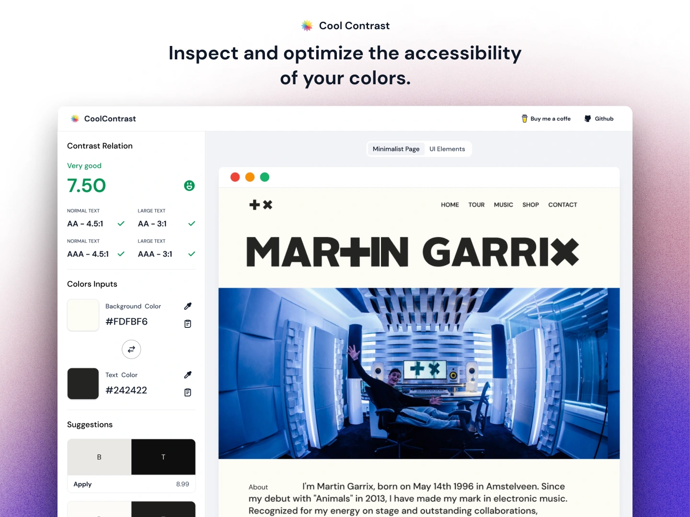

<p align="center">
  <br/>
  <a href="https://coolcontrast.vercel.app">Cool Contrast</a> is the tool that helps you create and inspect the perfect combination of your colors.
</p>

## Features

- ⚡️ Contrast suggestions to enhance your color combinations.
- 👀 Preview the results in a collection of UI elements.
- 🎨 Editing in different color modes.

## Install

Install packages

```bash
npm install
```

Run to generate panda-css output

```bash
npm run panda:prepare
```

Start the dev server

```bash
npm run dev
```

## License

MIT License © 2023-2024-Present [Alex Garrixen](https://github.com/AlexGarrixen)
